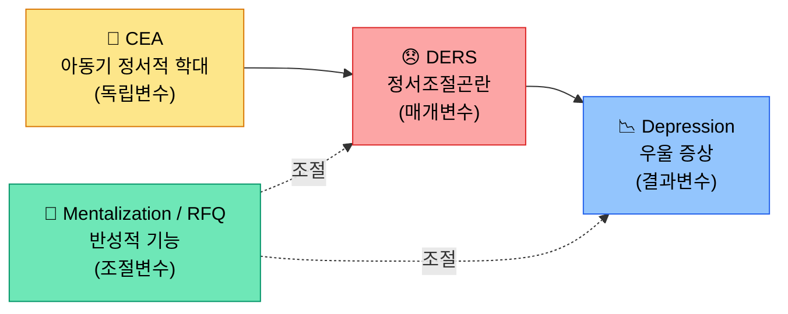

# 박건호 (Geonho Park)

> 임상/상담심리학 예정 대학원생 · AI × 정신건강 서비스 접근성 연구

---

## 연구 관심사

**핵심 테마: AI로 정신건강 서비스 접근성 혁신**

**Moderated Mediation** 구조 — CEA → DERS → Depression, Mentalization 조절

---

## 기술 스택

**통계 분석**: 매개·조절·조절된 매개 분석, ANOVA, 로지스틱 회귀

---

## 주요 활동

| 프로젝트 | 설명 |
|---------|------|
| 🤖 **COSS × SNU 2026** | AutoGen 기반 LLM 에이전트 동조 실험 · 5 에이전트, SD 조건 4종 |
| 🧑‍🤝‍🧑 **고립청년 집단상담** | 2025년 8회기 집단치료 보조 진행 |
| 📚 **PTSD 스터디** | PoED 프로그램 학습 · 외상 후 성장 이론 탐구 |
| 🗂️ **논문 관리 시스템** | 50+ 논문 자동화 파이프라인 (BibTeX, 태그 분류, 번역) |

---

## GitHub Stats

---

## 포트폴리오 & 저장소

🔗 **[geonhopark0210.github.io](https://geonhopark0210.github.io)** — 학습 노트 & 연구 기록 공개 지식 저장소

- `study/` — 통계학(17장), 교육학(7장) 학습 노트
- `research/` — 논문 읽기 노트, 번역, 태그 분류 체계
- `projects/` — 멀티에이전트 실험, 논문 관리 시스템 소개

---

*[@geonhopark0210](https://github.com/geonhopark0210)*
